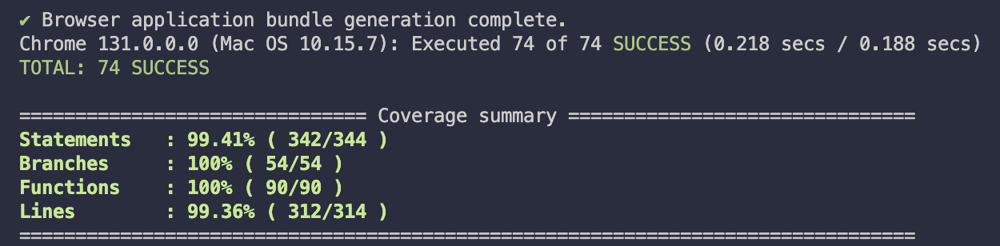

## Technical and Dependencies

- [x] Latest angular version
- [x] Latest bootstrap version for UI
- [x] ESLint for code quality
- [x] Complete README
- [x] Use unit test and have a good amount of code coverage
- [x] Be able to extend and new features

### Unit test coverage

## API Endpoints

- https://jsonplaceholder.typicode.com/posts/ to get the list of posts
- https://jsonplaceholder.typicode.com/posts/1/ to get the details of post with ID 1
- https://jsonplaceholder.typicode.com/users/1/ to get details of user with ID 1
- https://jsonplaceholder.typicode.com/albums/ to get list of albums
- https://jsonplaceholder.typicode.com/albums/1/ to get details of album with ID 1
- https://jsonplaceholder.typicode.com/photos/ to get list of photos
- https://jsonplaceholder.typicode.com/photos/1/ to get details of photo with ID 1

> Note
>
> - Total user is 10
> - Every user have 10 post, that means
> - Total post is 100
> - user 1 related to post 1-10, user 2 related to post 2-20, so on and so forth...
>
> ---
>
> - Total albums is 100
> - Each album contain 50 photos, which means
> - Total photos is 5000
> - Album 1 have photo 1-50, album 2 have photo 51-100, so on and so forth...

## Available Page

- Dashboard
- Posts - Post details
- Albums - Album details
- Photos - Photo details
- User details

## Page Component

- [x] Should lazily-load
- [x] Have loading indicator
- [x] Utilize query params for searching and filtering
- [x] Responsive

### Dashboard Page

- [x] Show statistics of posts, albums, and photos

### Posts Page

- [x] Have search feature
- [x] Have sort feature
- [x] Have pagination

### Albums Page

- [x] Have search feature
- [x] Have sort feature
- [x] Have pagination

### Album Details

- [x] Show related photos

### Photos Page

- [x] Have search feature
- [x] Have sort feature
- [x] Have pagination

### User Details

- [x] Show dummy avatar
- [x] Have user details
- [x] Show related post

---

## Extra Feature

- [x] Add link to post author
- [x] Show related album in photo details
- [x] Bookmark post
- [] Bookmark page
- [] 404 page
